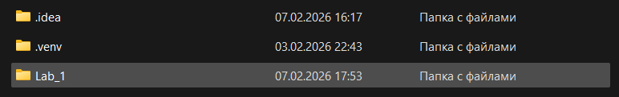
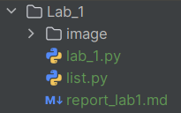

# Лабораторная работа №1 

## Тема: «Программирование в Python»
**Дисциплина:** Python для приложений  
**Студент:** Петровская Арина  
**Группа:** IA2504  
**Преподаватель:** Борш. Д  
**Год:** 2026  

---

### Описание лабораторной работы
В данной лабораторной работе были изучены основы программирования на Python. Создала программы с использованием разных 
типов переменных, научилась вводить данные от пользователя и выводить результаты. Работа включала изучение списков, 
кортежей, множеств и словарей, а также применение методов и функций для их обработки. Также освоила форматирование 
строк и базовые операции с данными. В итоге получила практические навыки, которые помогут в дальнейшем изучении Python.
#### Цель
Освоить базовые навыки программирования на языке Python, включая работу с переменными различных типов, 
вводом и выводом данных, использование структур данных (списки, кортежи, множества, словари), а также 
освоить основные операции и методы для обработки данных.
#### Задачи 
* Организация рабочей среды и создание простых программ с вводом/выводом данных.
* Изучение типов данных, их преобразование и базовых операций с переменными.
* Ознакомление с основными структурами данных Python (списки, кортежи, множества, словари) и методами их обработки.
* Применение форматирования строк и операторов для работы с данными.
* Анализ и объяснение примеров кода, а также развитие навыков устного представления программных решений.

---

### Выполнение лабораторной работы
### Задание 1

1. ##### Создаем новую директорию `Lab_1`, в которой будет храниться содержание первой лабораторной работы (рис. 1).  
   Каждая лабораторная работа будет иметь отдельную директорию.
   ###### рис. 1

2. ##### В директории `Lab_1` создаем нужные папки и файлы (рис. 2).

   ###### рис. 2
   ##### **Лабораторная работа имеет следующую структуру:**
    - папка `image` (хранение скриншотов экрана);
    - файл `lab_1.py` (работа с переменными);
    - файл `list.py` (работа с коллекциями);
    - файл `report_lab1.md` (оформление отчета лабораторной работы).
   
3. ##### В файле `lab_1.py` пишем код приветствия при помощи двух функций (рис. 3).
   - функция `print()` выводит сообщение на экран;
   - функция `input()` запрашивает от пользователя его имя.
   ```python
   print ('Привет, меня зовут Арина!')
   name = input('Введите ваше имя: ')
   
   print('Привет,', name)
   
   ```
   Вывод в консоли
   ```python
   Привет, меня зовут Арина!
   Введите ваше имя: Арина
   Привет, Арина
   
   ``` 

4. ##### Включаем два типа комментариев в программу 
   - однострочные (обозначаются #);
   - docstrings/многострочные (обозначаются """ """)
   ```python
   #3. Функции print() и input()
   """
   пункт 3.
   Функции print() и input()
   """
   
   ```

5. ##### Определяем четыре переменные разного типа 
   ```python
   number_first = 3 
   number_second = 2.4 
   text_value_1 = 'Здесь должен быть текст' 
   text_value_2 = ('Здесь должен быть '
                   'многострочный текст'
                   'с информацией')
   
   ```
   - целое;
   - вещественное;
   - текстовое (короткое/занимающее несколько строк).

6. ##### Выводим на экран тип данных при помощи функции `type`
   ```python
   print (type(number_second))
   print (type(text_value_1))
   
   ```

7. ##### При помощи функции `len` выводим длину строки 
   `print (len(text_value_2))`
   
   Вывод в консоли 
   ```python
   <class 'float'>
   <class 'str'>   
   
   ```

8. ##### Приведем одну из переменных к верхнему регистру
   `print (text_value_1.upper())`

   Вывод в консоли: `ЗДЕСЬ ДОЛЖЕН БЫТЬ ТЕКСТ`

9. ##### «Отрезаем», при помощи оператора [], а потом выводим подстроку из переменной `text_value_2`. Переменная хранит текст:
   ```python
   text_value_2 = ('Здесь должен быть '
                   'многострочный текст'
                   'с информацией')
   
   ```

   При помощи среза выводим первое слово в предложении нашей переменной
   ```python
   substring = text_value_2[0:6]
   print(substring)
   
   ```
   Вывод в консоли `Здесь`
10. ##### Способы вывода информации на экран
    - f“string”;
    - метод string.format()  
    Для начала объявим две переменные
    ```python
    age = 21
    city = 'Кишинев'
    
    ```
    Далее выведем информацию двумя способами
    ```python
    print(f'Мне {age} год')
    print('Мне {} год. Я живу в городе {}'.format(age, city))
    
    ```
    Вывод в консоли
    ```python
    Мне 21 год
    Мне 21 год. Я живу в городе Кишинев   
 
    ```
### Задание 2
##### Результаты интерпретирования кодов
#### 1
```python
txt = "More results from text..."
substr = txt[4:12]
print(substr)
print(substr.strip())
```
Вывод в консоли  

```
 result
result
```  
Функция `strip()` удаляет отступы с начала и с конца.
#### 2  
```python
txt = "More results from text..."
print(txt.split())
```  
Вывод в консоли  
`['More', 'results', 'from', 'text...']`
Метод `split()` создает список из всех слов в предложении.

#### 3
```python
age = 36
txt = "My name is Mary, and I am {}"
   
print(txt.format(age))
``` 
Вывод в консоли  
`My name is Mary, and I am 36`
Метод `format()` позволяет вставить значения переменной age вместо фигурных скобок в строку.

### Задание 3
1. ##### Создаем файл `list.py`

2. ##### Списки
   ##### Создаем список 
   `list_1 = [34, 46, 7, 75, 8, 0, 23]`  
   ##### Выводим на экран первый и третий элемент списка
   `print(list_1[0], list_1[2])`  
   Вывод в консоли  
   `34 7`
   ##### Заменяем элемент в списке
   ```python
   list_1 = [34, 46, 7, 75, 8, 0, 23]
   list_1[1] = 100
    
   print(list_1[1])
   
   ```  
    Вывод в консоли  
   `100`
   ##### Выполняем срез элементов
   `print(list_1[::-1])`  
   В данном случае элементы списка выведутся с конца  
   `[23, 0, 8, 75, 7, 100, 34]`
   ##### Применяем метод `append()`, который позволяет дополнить список
   ```python
   list_1 = [34, 100, 7, 75, 8, 0, 23]
   list_1.append(666)
    
   print(list_1)
   
   ```  
   Вывод в консоли  
   `[34, 100, 7, 75, 8, 0, 23, 666]`
   ##### Применяем функции. Находим минимальное и максимальное значения в списке
   ```python
   list_1 = [34, 100, 7, 75, 8, 0, 23, 666]
    
   maximum = max(list_1)
   minimum = min(list_1)
    
   print(maximum, minimum)
   
   ``` 
   Вывод в консоли  
   `666 0`
   ##### Применяем три оператора
   ```python
   list_1 = [34, 100, 7, 75, 8, 0, 23, 666]
    
   print(list_1 * 2)
   print(666 in list_1)
   print(list_1 == [2, 27, 4094, 746])
   
   ``` 
    - дублируем внутри списка элементы;
    - проверяем наличие элемента;
    - проверяем на одинаковость списки.
   Вывод в консоли
    ```
    [34, 100, 7, 75, 8, 0, 23, 666, 34, 100, 7, 75, 8, 0, 23, 666]
    True
    False
    ```

3. ##### КОРТЕЖИ
   ##### Создаем кортеж
   `tuple_1 = (34, 'a', 7, 'I', 8, 'w', 23)`
   ##### Выводим на экран тип данных
   `print(type(tuple_1))`  
   Вывод в консоли  
   `<class 'tuple'>`
   ##### Выводим первый и последний элемент `print(tuple_1[0], tuple_1[-1])`  
   Вывод в консоли `34 23`
   ##### Выполняем срез элементов `print(tuple_1[2::-2])`  
   Вывод в консоли `(7, 34)`
   ##### Применяем функции
   Изменяем кортеж на список 
   ```python
   new_list = list(tuple_1)
   print('Список из кортежа:', new_list)
   
   ``` 
   Вывод в консоли  
   `Список из кортежа: [34, 'a', 7, 'I', 8, 'w', 23]`  
   Изменяем кортеж на множество 
   ```python
   new_set = set(tuple_1)
   print('Множество:', new_set)
   
   ``` 
   Вывод в консоли  
   `Множество: {34, 'I', 'a', 7, 8, 23, 'w'}`  
   Проверяем наличие данных 
   ```python
   new = 34 not in tuple_1
   print(new)
   
   ``` 
   Вывод в консоли `False`
4. ##### Множество
   ##### Создаем множество и выводим его
   ```python
   set_1 = {1, 45, 76, 34, 1, 46, 1, 8}
   print(set_1)
   
   ```
   Вывод в консоли `{1, 34, 8, 76, 45, 46}`  
   Повторных элементов в множестве не должно быть, они удаляются автоматически
   ##### Применим метод `add()` 
   ```python
   set_1.add(100)
   print(set_1)
   
   ```
   Вывод в консоли  
   `{1, 34, 100, 8, 76, 45, 46}` 
    ##### Применим функцию `len()`   
   `print(len(set_1))`  
   Вывод в консоли `7`
5. ##### Словари
   ##### Создаем два словаря с численными и текстовыми ключами. Выводим их
   ```python
   dict_num = {
    10: 'математика',
    9: 'география',
    8: 'информатика'
   }

   dict_str = {
    'Кишинев': 'столица Молдовы',
    'Дублин': 'столица Ирландии',
    'Осло': 'столица Норвегии'
   }

   print(dict_num[8])
   print(dict_str['Дублин'])
   
   ```
   Вывод в консоли  
   ```
   информатика
   столица Ирландии   
   ```
   ##### Применяем методы
   Выводим ключи методом `keys()`  
   `print(dict_str.keys())`  
   Вывод в консоли 
   `dict_keys(['Кишинев', 'Дублин', 'Осло'])`  
   Выводим значения методом `values()`  
   `print(dict_str.values())`  
   Вывод в консоли 
   `dict_values(['столица Молдовы', 'столица Ирландии', 'столица Норвегии'])`  
   Удаляем значение
   ```python
   age_value = dict_str.pop("Осло")
   print("Удалено:", age_value)
   
   ```
   Вывод в консоли 
   `Удалено: столица Норвегии`
   ##### Применяем функции
   Выведем длину словаря и тип 
   ```python
   print(len(dict_num))
   print(type(dict_num))
   
   ```
   Вывод в консоли
   ```python
   3
   <class 'dict'>
   
   ```
   
6. ##### Вернемся в файл `lab_1.py`
   Изменим тип данных
   ```python
   age = 36
   new_age = str(age)

   print("Число: " + new_age)
   
   ```
   Вывод в консоли
   `36`
   ##### Где нам это поможет?
   - изменение данных от пользователя (изначально приходят в виде строки);
   - для правильного отображения на экране;
   - числовые данные могут прийти в строковом формате, и, чтобы делать математические операции, необходимо изменить тип;
   - преобразование коллекций.
### Задание 4
##### Работаем в файле `list.py`
1. ##### Создаем два списка (с текстом и числами)
   ```python
   list_num = [344, 500, 765]
   list_str = ['магний', 'кальций', 'натрий']
   
   ```
   ##### Выводим на экран двумя способами
   ```python
   # Способ 1
   info1 = "Товар: {}, Цена: {} руб.".format(list_str[0], list_num[0])
   info2 = "Товар: {}, Цена: {} руб.".format(list_str[1], list_num[1])
   info3 = "Товар: {}, Цена: {} руб.".format(list_str[2], list_num[2])

   print(info1)
   print(info2)
   print(info3)
   
   ```   
   Вывод в консоли   
   ```
   Товар: магний, Цена: 344 руб.
   Товар: кальций, Цена: 500 руб.
   Товар: натрий, Цена: 765 руб.
   ```   
   ```python
   # Способ 2
   for i in range(3):
       print('{}: {}'.format(list_str[i], list_num[i]))
   
   ```  
   Вывод в консоли   
   ```
   магний: 344
   кальций: 500
   натрий: 765
   ```  
2. ##### Просим у пользователя чтобы он ввёл свой возраст. Сразу данные переобразовывем в `int`
   `age = int(input('Введите ваш возраст '))`
   ##### Далее увеличиваем возраст и выводим на экран
   ```python
   new_age = age + 5

   print(f'Через 5 лет вам будет: {new_age}')
   
   ``` 
   Вывод в консоли   
   ```
   Введите ваш возраст 21
   Через 5 лет вам будет: 26
   ```  
### Вывод
Все поставленные цели и задачи были выполнены успешно. Изучила основы Python, типы данных, работала со 
строками и операторами, научилась использовать функции и методы, ознакомилась с основными структурами данных,
а также получила практические навыки работы с кодом. Лабораторная помогла закрепить знания и лучше понять 
программирование.
### [Официальная документация для Python 3.14.3.](https://docs.python.org/3.14/)


