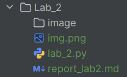

# Лабораторная работа №2
## Тема: Построение собственных функций в Python. Условные инструкции.
**Дисциплина:** Python для приложений  
**Студент:** Петровская Арина  
**Группа:** IA2504  
**Преподаватель:** Борш Д.  
**Год:** 2026  

---

### Описание лабораторной работы

#### Цель
Изучить принципы создания и использования собственных функций в языке программирования Python, освоить 
применение лямбда-функций и условных операторов, а также научиться обрабатывать пользовательский ввод и проверять корректность данных.
#### Задачи 
* Изучить принципы создания и использования функций в языке Python.
* Освоить применение лямбда-функций для решения простых задач.
* Научиться использовать функцию sorted() с параметром key для сортировки данных.
* Развить навыки проверки и обработки пользовательского ввода с помощью условных операторов.
* Реализовать функцию для вычисления среднего значения оценок и определения результата обучения.
---

### Выполнение лабораторной работы
##### Перед выполнением создаем новую директорию `Lab_2`, в которой будет храниться содержание второй лабораторной работы.  
##### В директории `Lab_2` создаем нужные папки и файлы (рис. 1).
###### рис. 1
##### **Лабораторная работа имеет следующую структуру:**
- папка `image` (хранение скриншотов экрана);
- файл `lab_2.py` (работа с переменными);
- файл `report_lab2.md` (оформление отчета лабораторной работы).
1. ##### Проанализируем коды  
   Дан пример
   ```python
   greet_user = lambda name : print('Hello My Dear,', name)
   user_name = input("What is your name? ")
   greet_user(user_name)
   
   ```
   Вывод программы
   ``` 
   What is your name? Arina
   Hello My Dear, Arina
   ```
   В данном примере lambda-функция записывается в переменную, с которой в последующем работаем. Цель функции - вывести
   имя пользователя на экран. После анонимной функции создаем переменную, где запрашиваем имя пользователя и выводим на 
   экран. В переменную, где хранится функция, передаем имя пользователя.
2. ##### Сортировка списка
   **Отсортируем список из 7 элементов-кортежей, состоящих из 2-х элементов по второму элементу**  
   Дан кортеж  
   `data = [(3, 11), (1, 7), (7, 8), (16, 88), (23, 15), (5, 3), (9, 20)]`  
   Далее пишем лямбда-функцию, которая берёт второй элемент в каждом кортеже `x[1]` и сортируем список при помощи функции 
   `sorted()`. Выводим на экран
   ```python
   sorted_data = sorted(data, key=lambda x: x[1], reverse=False)
   print(sorted_data)
   
   ```  
   Вывод в консоли   
   `[(5, 3), (1, 7), (7, 8), (3, 11), (23, 15), (9, 20), (16, 88)]`
   
   ❗Можно изменить список по убыванию, тогда необходимо поменять логическое значение `reverse=True`
3. ##### Создаем лямбда-функцию, которая возводит число в квадрат
   Для начала импортируем встроенный математический модуль `import math`  
   Пишем лямбда-функцию с двумя переменными. Возводим число в квадрат `math.pow()`  
   `number = lambda x, y: print(math.pow(x, y))`  
   Запрашиваем у пользователя данные и выводим результат  
   ```python
   number_1 = int(input ('Введите первое число: '))
   number_2 = int(input ('Введите второе число: '))
   number(number_1, number_2)
   
   ```
   Вывод в консоли    
   ```
   Введите первое число: 2
   Введите второе число: 3
   8.0
   
   ```
4. ##### Функции
   ##### _С параметрами_
   В данном случае функция обязательно имеет наличие параметров `(x, y)`
   Например:
   ```python
   def number(x, y):
       pow_number = math.gcd(x, y)  # наибольший общий делитель
       return pow_number
   
   ```
   Запрашиваем у пользователя данные и выводим результат
   ```python
   num_1 = int(input ('Введите первое число: '))
   num_2 = int(input ('Введите второе число: '))
   print('НОД:', number(num_1, num_2))
   
   ```    
   Вывод в консоли    
   ```
   Введите первое число: 4
   Введите второе число: 7
   НОД: 1
   
   ```
   ##### _Без параметров_
   ##### Первый способ
   В данном случае функция не имеет параметры `()`.  
   Например:
   ```python
   def get_name_1():
       return 'Меня зовут Арина'
   
   print(get_name_1())
   
   ```
   ❗При этом у пользователя не запрашиваем данные.   
   Вывод в консоли `Меня зовут Арина`

   ##### Второй способ
   ```python
   def get_name_2():
       print ('Меня зовут Арина')

   get_name_2()
   
   ```
   Вывод в консоли `Меня зовут Арина`  
   В случае, если у нас `print()` есть в функции, то вызов производится вызовом функции без наличия `print`.  
   ##### С предопределенными параметрами
   ```python
   def draw_line(num=5, symbol='-'):
       print(symbol * num)

   draw_line()
   
   ```
5. ##### Задача
   Напишите функцию на Python с именем `average_mark()`, которая принимает четыре параметра - `average_mark(test, 
   laboratory, exam, individual)`: оценку за тест, лабораторную, экзамен и индивидуальное задание.
   Функция должна вычислить среднее арифметическое четырёх оценок, введённых пользователем, и вернуть:
   - «Зачёт», если среднее значение >= 5
   - «Не зачёт», если среднее значение < 5.  
   
   Проверьте, чтобы все введённые оценки были целыми числами от 1 до 10.
   В случае, если при вводе значений это условие не соблюдается, функция должна вернуть сообщение «Неверная оценка!».
   ##### Программа
   - Создаем функцию с четырьмя параметрами  
   - Образовываем из данных список для последующей работы с данными
   - Находим среднее арифметическое значение при помощи встроенных функций `sum()` и `len()`, и выводим на экран
   ```python
   def average_mark(test, laboratory, exam, individual):
       list_mark = [test, laboratory, exam, individual]
       avg_element = sum(list_mark) / len(list_mark)
       print('Ваш средний балл:', list_mark)
   
   ```
   -  Создаем цикл `for`, где проходимся по элементам цикла. В случае если оценка неверная выводим ошибку
   ```python
    for mark in list_mark:
        if not isinstance(mark, int) or mark < 1 or mark > 10:
            print ('Неверная оценка!')
   
   ```
   - Проверяем средний балл
   ```python
    if avg_element >= 5:
        return 'Зачет'
    else:
        return 'Незачет'
   
   ```
   - Далее просим пользователя ввести оценки и выводим результат
   ```python
   test_num = int(input('Введите оценку за тест:'))
   test_laboratory = int(input('Введите оценку за лабораторную:'))
   test_exam = int(input('Введите оценку за экзамен:'))
   test_individual = int(input('Введите оценку за индивидуальную работу:'))

   print(average_mark(test_num, test_laboratory, test_exam, test_individual))
   
   ```
### [Официальная документация для Python 3.14.3.](https://docs.python.org/3.14/)