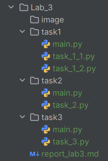

# Лабораторная работа №2
## Тема: Построение собственных функций в Python. Условные инструкции.
**Дисциплина:** Python для приложений  
**Студент:** Петровская Арина  
**Группа:** IA2504  
**Преподаватель:** Борш. Д  
**Год:** 2026  

---

### Описание лабораторной работы
В данной лабораторной работе были разработаны программы на языке Python, направленные на закрепление навыков работы с 
функциями, модулями, условными операторами, циклами и структурами данных. В ходе работы реализованы задачи, связанные 
с обработкой пользовательского ввода, использованием словарей и списков, а также созданием программ с меню. Программы разделены на основной файл и отдельные модули с функциями.
#### Цель
Изучить использование функций, модулей, списков и циклов в Python, а также научиться организовывать программу с меню 
и обработкой пользовательского ввода.
#### Задачи
- Создать функции для вывода, добавления и удаления товаров из списка.
- Реализовать меню для выбора действий пользователем.
- Организовать цикл работы программы до выбора пункта «Выход».
- Реализовать проверку корректности вводимых пользователем данных.
- Вынести функции в отдельный модуль и импортировать его в основную программу.

---

### Выполнение лабораторной работы
##### Перед выполнением создаем новую директорию `Lab_3`, в которой будет храниться содержание третьей лабораторной работы.  
##### В директории `Lab_3` создаем нужные папки и файлы (рис. 1).
###### рис. 1
##### **Лабораторная работа имеет следующую структуру:**
- папки `image`, `task1`, `task2`, `task3` (хранение скриншотов экрана и файлов с реализованными задачами);
- файлы `task_1_1.py`, `task_1_2.py`, `task_2.py`, `task_3.py`, `main.py` (файлы со скриптами)
- файл `report_lab3.md` (оформление отчета лабораторной работы).
##### Задача 1. Создать калькулятор «идеального веса», используя формулу Лоренса
##### Требования:
Формула Lorentz-a, в зависимости от возраста:  
М: Идеальный вес (кг) = Рост (см) – 100 – ((Рост (см) – 150)/4 + (Возраст (годах) – 20)/4)  
Ж: Идеальный вес (кг) = Рост (см) – 100 – ((Рост (см) – 150)/2.5 + (Возраст (годах) –
20)/6)
Условия: 
- рост не может быть ниже 150см и выше 220см;
- вес не может быть ниже 45кг и выше 300кг;
- возраст должен быть выше 20 и ниже 120;
- для пола - были ранее указаны возможные значения для ввода.
Необходимо валидировать все значения.
#### Выполнение:
#### Программа состоит из двух файлов:
- `main.py`
- `task_1_2.py`  
#### В `task_1_2.py` создаем все необходимые функции
- `def get_age()` для валидации возраста
- `def get_height()` для валидации роста
- `def get_weight()` для валидации веса
- `def get_gender()` для валидации пола
- `def lorentz_formula` для высчитывания идеального веса
#### В `main.py` запускаем программу
```python
import task_1_2 as f

print('Калькулятор идеального веса')

def main():
    age = f.get_age()
    height = f.get_height()
    gender = f.get_gender()
    weight = f.get_weight()

    ideal_weight = f.lorentz_formula(gender, height, age)

    print('Идеальный вес:', round(ideal_weight, 2), 'кг')

    difference = weight - ideal_weight

    if difference > 0:
        print("Ваш вес выше нормы. Рекомендуется снизить вес.")
    elif difference < 0:
        print("Ваш вес ниже нормы. Рекомендуется набрать вес.")
    else:
        print("Ваш вес идеальный!")


if __name__ == "__main__":
    main()
```
##### Задача 2. Рассчитать сколько лет кошке в человеческих годах
Создать программу на Python, которая рассчитывает возраст кошки в человеческих годах. Если кошке меньше года, 
пользователь вводит возраст в месяцах (1–11), и программа определяет человеческий возраст с помощью словаря. 
Если кошке больше года, пользователь вводит возраст в годах (1–35), после чего программа вычисляет человеческий 
возраст по заданной формуле. Все функции должны быть вынесены в отдельный модуль и вызываться из основной программы.
#### Выполнение:
#### Программа состоит из двух файлов:
- `main.py`
- `task_2.py`  
#### В `task_2.py` создаем все необходимые функции.
- `def get_age()` для проверки кошки меньше года или нет
- `def get_month()` для возраста, если меньше года
- `def get_year()` для возраста, если больше года
- `def months_to_human()` словарь для определения человеческого возраста
- `def years_to_human` высчитывание возраста
#### В `main.py` запускаем программу.
##### Функция `def years_to_human`
```python
def years_to_human(year):
    if year == 1:
        return 18
    elif year == 2:
        return 25
    elif 3 <= year <= 15:
        return 25 + (year - 2) * 4
        # 25 — человеческий возраст кошки после 2 лет (1 год = 18, 2 года = 25).
        # 'year - 2' — считаем сколько лет прошло после второго года.
        # 4 — каждый год кошки с 3 до 15 считается как 4 человеческих года.

    else:
        return 25 + (13 * 4) + (year - 15) * 3
        # 25 — возраст после первых 2 лет.
        # 13 * 4 — годы с 3 до 15:
        # 15 − 2 = 13 лет, каждый по 4 человеческих → 52.
        # year - 15 — сколько лет прошло после 15 лет.
        # 3 — после 15 лет каждый год кошки = 3 человеческих.
```
##### Файл `main.py`
```python
import task_2 as f

print("Калькулятор возраста кошки")

def main():
    if f.get_age():
        month = f.get_month()
        human_age = f.months_to_human(month)
        print("Возраст кошки в человеческих годах:", human_age)

    else:
        year = f.get_year()
        human_age = f.years_to_human(year)
        print("Возраст кошки примерно", human_age, "человеческих лет")


if __name__ == "__main__":
    main()
```
Программа импортирует модуль task_2, в котором находятся все необходимые функции, и задаёт ему псевдоним f. 
Затем выводится название программы - «Калькулятор возраста кошки».
В функции main() сначала вызывается функция get_age(), которая определяет, меньше ли кошке одного года. 
Если кошке меньше года, программа запрашивает возраст в месяцах, переводит его в человеческий возраст с помощью функции 
months_to_human() и выводит результат. Если кошке больше года, программа запрашивает возраст в годах, вычисляет 
человеческий возраст с помощью функции years_to_human() и выводит его на экран.
В конце используется конструкция if __name__ == "__main__":, которая проверяет, запущен ли файл напрямую. 
Если да - вызывается функция main(), и программа начинает работу.  
##### Задача 3. Создание списка покупок (shopping list)
#### Выполнение:
#### Программа состоит из двух файлов:
- `main.py`
- `task_3.py`   
Определяем 3 функции в `task_3.py` : для добавления товара в списке, для удаления выбранного товара из списка, для вывода всех 
элементов списка.
- `add_product()` для добавления товара в списке
- `def delete_by_number()` для удаления выбранного товара из списка по номеру
- `def elete_by_name()` для удаления выбранного товара из списка по названию
- `def show_products()` для вывода всех элементов списка
В `main.py` создаем меню
```python
def menu():
    print("\nМЕНЮ\n1. Вывести список товаров\n2. Добавить товар\n3. Удалить товар\n4. Выход")
```

```python
while True:
    menu()
    choice = input("Выберите опцию: ")

    if choice == "1":
        f.show_products(products)

    elif choice == "2":
        f.add_product(products)

    elif choice == "3":
        f.delete_product(products)

    elif choice == "4":
        print("Выход из программы")
        break

    else:
        print("Неверная опция. Попробуйте снова.")
```
Создаётся бесконечный цикл, который будет работать, пока пользователь не выберет выход из программы.
Вызывается функция, которая выводит меню с доступными действиями.
Программа ждёт, пока пользователь введёт номер нужного пункта меню.
Далее идёт проверка выбора пользователя.
### [Официальная документация для Python 3.14.3.](https://docs.python.org/3.14/)