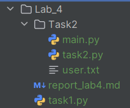

# Лабораторная работа №4
## Тема: Регулярные выражения. Обработка файлов данных и регулярные выражения
**Дисциплина:** Python для приложений  
**Студент:** Петровская Арина  
**Группа:** IA2504  
**Преподаватель:** Борш. Д  
**Год:** 2026  

---

### Описание лабораторной работы  
В данной лабораторной работе рассматривается применение регулярных выражений в языке программирования Python для 
проверки корректности вводимых данных, а также работа с файлами для хранения и обработки информации. Особое внимание 
уделяется валидации пользовательского ввода, обработке исключений с помощью конструкции `try..except`, а также организации 
структуры программы с использованием функций и модулей.
В рамках работы реализуются две задачи: проверка корректности номера телефона по заданному формату и разработка системы 
учета данных о детях сотрудников с возможностью записи, чтения и анализа информации из файла.
#### Цель  
Изучить и закрепить навыки использования регулярных выражений в Python, обработки исключений, а также освоить работу с 
файлами и структурирование программного кода с помощью функций и модулей.
#### Задачи
* Освоить применение конструкции try..except для обработки ошибок ввода.
* Организовать циклический ввод данных до получения корректного результата.
* Разработать программу с меню для работы с данными сотрудников.
* Применить методы работы со строками (`split()`, `strip()`).
* Обеспечить корректное форматирование и хранение данных в файле.
* Структурировать программу с использованием функций и (при необходимости) модулей.

---

### Выполнение лабораторной работы
Перед выполнением создаем новую директорию `Lab_4`, в которой будет храниться содержание четвертой лабораторной работы.  
В директории `Lab_4` создаем нужные папки и файлы (рис. 1).  
###### рис. 1
##### **Лабораторная работа имеет следующую структуру:**
- папки `image`, `task2`;
- файлы `task1.py`, `task2.py`, `main.py` (файлы со скриптами)
- файл `report_lab4.md` (оформление отчета лабораторной работы).
- тексовый файл `user.txt` для реализации второй задачи.
##### Задача 1. Проверка валидности номера телефона
##### Требования:
* Ввод номера телефона с клавиатуры.
* Проверка номера через регулярные выражения.
* Допустимые форматы: +373XXXXXXXX, 00373XXXXXXXX, XXXXXXXX, 0XXXXXXXX.
* Использовать `try..except` для обработки ошибок.
* Использовать цикл - ввод повторяется, пока номер неверный.
* При ошибке - сообщение и повтор ввода.
* При правильном вводе - вывести номер и похвалу.  

Для работы с регулярными выражениями используется модуль `re`  
Создаем в функции переменную, где используем паттерн `pattern = r'^(?:\+373\d{8}|00373\d{8}|0\d{8}|\d{8})$'`  
Далее создаем бесконечный цикл `while`, где у пользователя будет запрашиваться номер до тех пор, пока он не введет корректные данные.
Используем `try...except` для корректного вывода ошибки. В цикле используется `raise`, команда которая генерирует исключение.  
```python
if not phone:
    raise ValueError("Пустой ввод!")
```
Используется функция из модуля `re` которая сравнивает всю строку, вводимую пользователем, со строкой из паттерна.
```python
if re.fullmatch(pattern, phone):
    print(f"Номер {phone} введён корректно")
    break
```
В случае, если ввели неправильные данные, вызывается блок `except`, где выводится ошибка.
```python
except Exception as e:
    print(f"Ошибка ввода: {e}")
    print("Попробуйте ещё раз.\n")
```
_Вывод в консоли_
```python
Введите номер телефона: 564765
Неверный формат номера. Попробуйте снова.
Введите номер телефона: +37368057684
Номер +37368057684 введён корректно
```

##### Задача 2. Учет данных о детях сотрудников компании “Подарки всем”
1. Создаем файл `main.py`. Прописываем функцию `main` где пропишем меню через `print`. Далее пользователь
вводит число (1-4) и программа проходится по циклу. Пользователь может ввести данные, вывести на экран, 
бездетные сотрудники, выход из программы.
```python
if choice == "1":
    f.input_data()
elif choice == "2":
    f.show_data()
elif choice == "3":
    f.no_children()
elif choice == "4":
    print("Выход...")
    break
else:
    print("Неверный выбор!")
```
2. В файле `task2.py` импортируем модуль для работы с регулярными выражениями и создаем пустой файл `FILE = 'user.txt'`  
Создаем функцию `input_data()` ввода данных, которая запрашивает данные и делает проверку на корректность. В бесконечном цикле 
пользователь вводит свои данные (фамилию, имя, отдел, количество детей). Изначально прописываем обработку ошибок, в 
случае если какой-то ввод неверный. Каждый ввод имеет свой паттерн или условие.  
- Для имени и фамилии: `pattern = r'^[А-яа-я]{2,20}(-[А-яа-я]{2,20})*$'`  
- Для отдела: `pattern = r'^[А-яа-я0-9]+( [А-яа-я0-9]+)?$'`  
- Для кол-ва детей: `return number.isdigit() and 0 <= int(number) < 18`  

3. После того как все данные введены корректно, создаем функцию `input_data()`, которая будет вызываться в случае, если 
пользователь выберет `1`. Изначально обрабатываем данные, а далее открываем файл в режиме `a(append)`, для дозаписи файла.
```python
with open(FILE, 'a', encoding='utf-8') as f:
    f.write(f"{surname}\t{name}\t{department}\t{children}\n")
```
_Вывод в консоле_
```python
Выберите пункт: 1
Введите фамилию: Петровская
Введите имя: Арина
Введите отдел: Отдел кадров
Введите количество детей: 0
Данные успешно сохранены!
```
4. Если пользователь ввел `2`, то показываем данные, которые уже есть в файле через функцию `show_data()`.
Необходимо открыть файл в режиме `'r'(read)` и объявить новую пустую переменную, которая будет считать количество детей.
`all_children = 0`  
Проходим циклом построчно
```python
for line in f:
    surname, name, department, children = line.strip().split('\t')

    print(f'{surname} {name} ({department}) - детей: {children}')
    all_children += int(children)

print(f'\nОбщее количество детей: {all_children}')
```  
_Вывод в консоли_
```python
Выберите пункт: 2
Соколов Сергей (отдел_кадров) - детей: 3
Петровская Арина (Отдел_кадров) - детей: 0

Общее количество детей: 3
```
5. В случае, если пользователь ввел `3`, выводится функция вывода в отдельном списке, фамилии и имени сотрудников у 
которых нет детей. Открываем файл в режиме `r(read)` для чтения. Проходимся циклом по каждой строке в файле и если количество 
детей равно нулю, то выводится фамилия и имя сотрудника.
```python
for line in f:
    surname, name, department, children = line.strip().split('\t')

    if int(children) == 0:
        print(f'{surname} {name}')
```  
_Вывод в консоли_
```python
Выберите пункт: 3

Сотрудники без детей
Петровская Арина
```
6. Если пользователь ввел `4`, программа завершает работу `break`.  
_Вывод в консоли_
```python
Выберите пункт: 4
Выход...
```
_**Использовались методы:**_
- `strip()` удаляет пробелы, табы и переносы строк;
- `replace()` заменяет один элемент на другой.

### [Официальная документация для Python 3.14.3.](https://docs.python.org/3.14/)